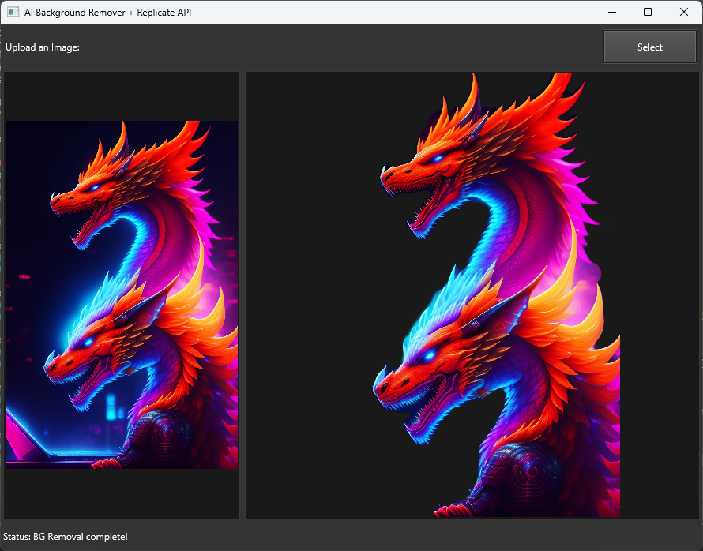

# AI Background Remover with Upscale Enhancement - DelphiFMX Python GUI

This project provides a graphical user interface (GUI) for removing backgrounds from images and enhancing them using AI through the [Replicate API](https://replicate.com). The GUI is built using DelphiFMX for Python, offering a simple and intuitive way for users to upload images and receive background-removed, upscaled versions. The app runs background processes without blocking the user interface.

## Features
- **Background Removal**: Remove the background of uploaded images using AI.
- **Upscale Enhancement**: Add detail to the upscaled image after the background is removed.
- **Status Updates**: Real-time status updates on the processing of the image.
- **Background Processing**: Image processing runs in the background to keep the UI responsive.

## Screenshot

Below is a screenshot of the GUI in action:



## Prerequisites
- Python 3.7 or higher
- [Replicate API Token](https://replicate.com/docs/get-started) (you need to set this up and add it to your environment variables)
- [DelphiFMX for Python](https://github.com/Embarcadero/PythonFMX)

## Installation

1. Clone this repository:
    ```bash
    git clone https://github.com/your-username/ai-background-remover.git
    cd ai-background-remover
    ```

2. Install the required Python packages:
    ```bash
    pip install delphifmx replicate
    ```

3. Set your Replicate API token:
    ```bash
    export REPLICATE_API_TOKEN=your_replicate_api_token
    ```

4. Run the application:
    ```bash
    python main.py
    ```

## Usage

1. **Upload an Image**: Click the "Select" button to choose an image from your computer.
2. **Processing**: Once the image is uploaded, the app will automatically start the background removal process using the Replicate API.
3. **View Results**: After processing, the original image and the enhanced background-removed image will be displayed side by side. The status bar at the bottom of the app provides real-time updates on the image processing.

## Project Structure

- **`bgremover.py`**: The main Python script that contains the GUI logic and handles interaction with the Replicate API.
- **`Air.style`**: The custom UI style applied to the application. You can replace or modify this file to change the appearance of the app.
- **Image Display**: The app shows both the original and processed images within the GUI.
  
## Code Overview

### Import Section

```python
import os
import replicate
import urllib.request
import hashlib
from delphifmx import *
import threading
```

- **Replicate API**: Used for handling AI-powered background removal and enhancement.
- **DelphiFMX**: The GUI framework for creating the interface.
- **Threading**: Ensures the app remains responsive by running background tasks asynchronously.

## How It Works

1. **Upload Image**: The user selects an image from their local machine.
2. **Background Removal and Enhancement**: The app sends the image to the [smoretalk/rembg-enhance](https://replicate.com/smoretalk/rembg-enhance) model hosted on Replicate.
3. **Display Result**: Once processing is complete, the background-removed and enhanced image is displayed alongside the original.

### Example Code Snippet

```python
model = replicate.models.get("smoretalk/rembg-enhance")
version = model.versions.get("4067ee2a58f6c161d434a9c077cfa012820b8e076efa2772aa171e26557da919")
self.prediction = replicate.predictions.create(
    version=version,
    input={"image": open(file_path, "rb")}
)
```

## Contributing

Feel free to submit pull requests or open issues for suggestions and improvements.

## License

This project is licensed under the MIT License.

## Links

- [Replicate API](https://replicate.com)
- [DelphiFMX for Python](https://github.com/Embarcadero/PythonFMX)
This README provides a comprehensive overview of your project, explaining how to install, use, and contribute to it while also including code snippets to give users a quick understanding of its core functionality.
